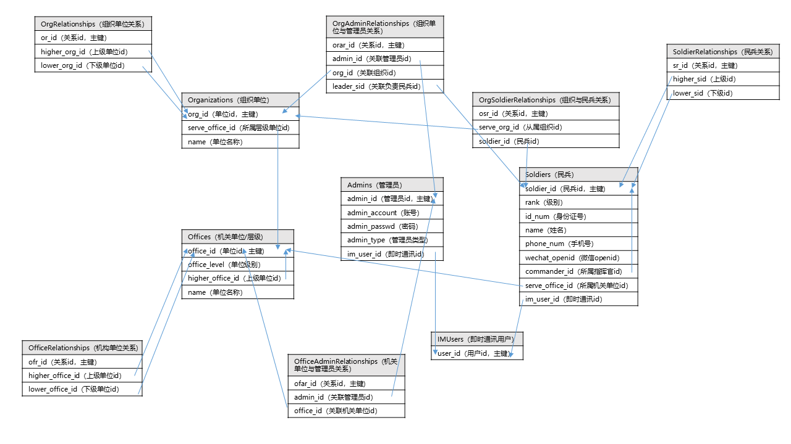
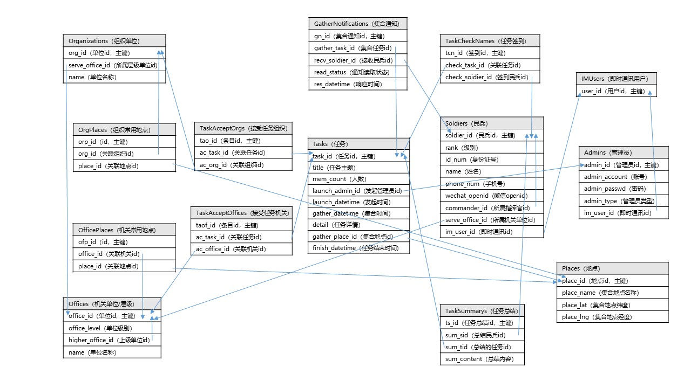

# 专业技术兵员精准动员实时指挥系统

**[图片路径](https://github.com/MBControlGroup/command-system/tree/master/design_docs)**

## 需求文档

[专业技术兵员精准动员实时指挥系统需求分析文档——腾讯文档](https://docs.qq.com/doc/BqI21X2yZIht10CYh118PMy61XMWSz0bstpX19oZGS19zfpI4 )

## 用例图

## 管理端原型

[管理端原型设计](https://2njuqd.axshare.com/#g=1&p=登录)

## 小程序端原型

[小程序端原型设计](https://modao.cc/app/9KNjMcOJs03gnrgyfRhmxdM7LAljs7Q)

## 数据库表

### 数据库表设计文档

[数据库表——腾讯文档](https://docs.qq.com/sheet/BqI21X2yZIht1OeHzN4IrNKM2LZciQ4P11Qd4rnIMT4aCLK84 )

### 表的关系图

**（注意！由于数据库表较多，下面每张图只展示了其对应功能模块直接相关的数据库表，但是表之间的关联仍然存在。）**

#### 人事管理

##### 注意事项

- 添加管理员（Admin）或民兵（Soldier）时，需要先添加即时通讯用户（IMUser）
- 添加民兵、组织、机关时需要相应添加上下级关系条目

##### 关系图

#### 任务管理

##### 注意事项

- 添加任务（Task）时，如果使用新的地点，需要插入新的Place条目，并且将Place加到发布者所在组织或机关的常用地址列表中
- 使用TaskAcceptOrgs和TaskAcceptOffices记录对组织和机关的任务，但无论是针对机关、组织还是个人的任务，最后执行任务都是民兵，所以发布任务**都需要**采用GatherNotification来进行细化到个人的任务记录

##### 关系图

#### 消息管理

##### 注意事项

- 使用BcMsgOrgs和BcMsgOffices记录对组织和机关发布的消息，但无论是针对机关、组织还是个人的通知，最后接收通知都是民兵，所以发布消息**都需要**采用CommonNotifications来进行细化到个人的消息记录

##### 关系图

## 架构图

常用的功能作为核心服务开发。核心服务之上的是微服务。

## 服务器API设计

[服务器API设计草稿——腾讯文档](https://docs.qq.com/doc/BqI21X2yZIht1LMhNH4XCzrf144lFz2m6eW641MPyi0BOmg03)

[服务端 REST API设计](https://pmcs.docs.apiary.io/#)
